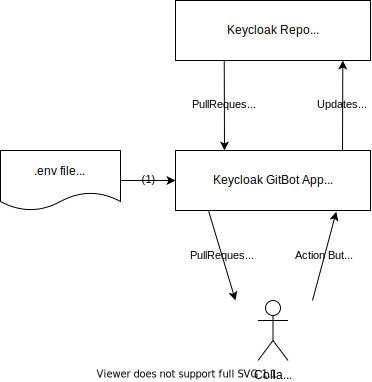

= Developer's Guide for Keycloak GitBot
:icons: font

== Architecture

.System overview

<1> Read configuration at startup.
<2> Read pull request data via GraphQL on demand, process data to identity potential actions.
<3> Show list of pull requests and potential actions to the collaborator.
<4> Submit collaborator's choices to the app via htmx.
<5> Use GitHub's REST API to perform the actions.

== Development

=== Technologies used

https://quarkus.io/[Quarkus] as application the framework::
Quarkus is a fast and flexible application framework that allow for short startup times.
It provides a base application for GitHub applications that will allow the application to eventually react automatically to changes on GitHub.

https://freemarker.apache.org/[FreeMarker] as the template engine::
A stable and fast template engine that integrates nicely in the Java environment. It allows to deliver the views for the pull requests. It allows structuring the content using includes.

https://bulma.io/[Bulma] as the CSS framework::
A fresh and light-weight CSS framework for UIs.

https://htmx.org/[htmx] as the client-side AJAX support::
When the users interact with the application to trigger actions, the application shouldn't reload the whole page.
Htmx allows for HTML actions to be submitted to the server. The HTML fragment returned by the server replaces than part of the already displayed pages.

https://github.com/smallrye/smallrye-graphql[SmallRye GraphQL] to access GitHub's data via GraphQL::
Pull data from GitHub via GraphQL interface. This allows to collect the needed data from pull requests and all related entities.

=== Developer Resources

* https://docs.github.com/en/search-github/searching-on-github/searching-issues-and-pull-requests[How to search issues and pull requests]
* https://github.com/keycloak/keycloak/pulls[Try out Keycloak searches]

== Adding functionality

TODO